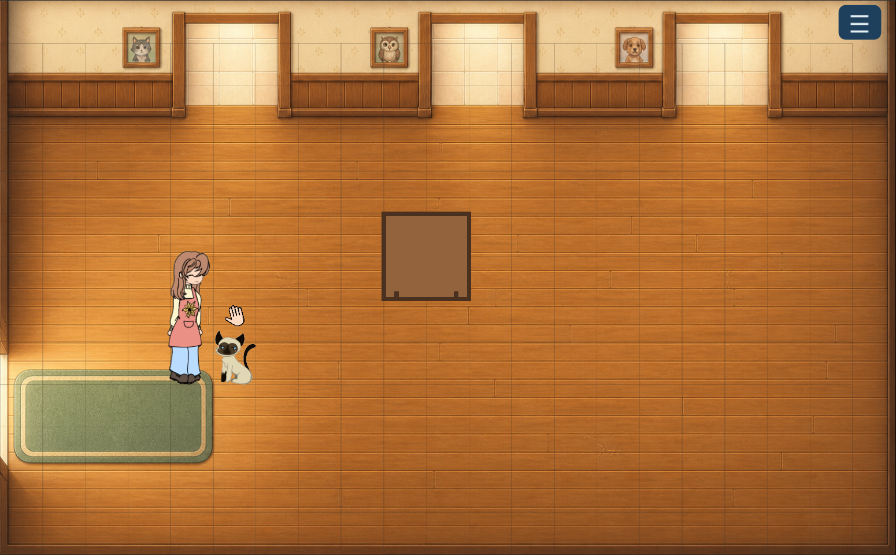
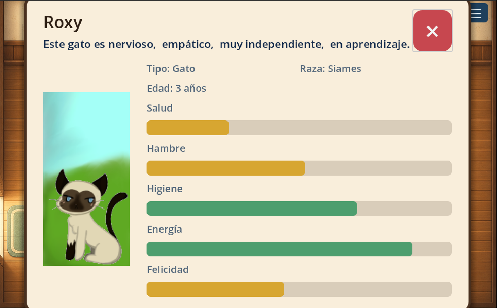

# Refugio de animales

Prototipo 2D en Godot: salas de 20 x 12 casillas útiles, con una fila superior
adicional para el menú. La resolución de diseño es 1008 x 624 (casillas de 48 px)
y Godot la escala manteniendo la proporción en PC, tablet y móvil. El personaje
ocupa una casilla de ancho y conserva el aspect ratio de su ilustración; solo su
base inferior colisiona y decide Y-Sort, navegación y transiciones.





## Arquitectura de contenido

Cada sala usa un `RoomData` para sus objetos y tres capas `TileMapLayer` para su
mapa:

- `FloorTiles`: suelos caminables.
- `WallTiles`: paredes; cada tile de pared ya contiene su colisión.
- `ForegroundTiles`: decoración alta ordenada por Y.
- `PlacedObjectData`: escena y casilla base de cada objeto colocado.

El recurso compartido `assets/tiles/shelter/shelter_tileset.tres` es la fuente
de verdad de los tiles. Pintar una pared crea automáticamente su colisión;
pintar suelo no crea ninguna.

Las transiciones usan una instancia reutilizable de `Doorway` (`Area2D`) dentro
de cada escena de habitación. Cada puerta selecciona en el Inspector su escena
destino, el nombre del `Marker2D` de aparición y un sonido opcional.

`RoomOccupancy` combina automáticamente las paredes físicas del TileMap y los
objetos para generar navegación nativa. La sala no conoce tipos concretos como
gatos, mesas o alfombras.

```text
PlaceableObject
└── AnimalObject
    ├── Cat
    │   └── CatSiames
    └── Dog
        ├── DogBeagle
        ├── DogGermanSheperd
        ├── DogHuskie
        └── DogPoodle
```

Los muebles heredan directamente de `PlaceableObject`. Cada tipo declara las
casillas visuales, las que bloquea y las de interacción. Por ejemplo: un gato se
ve en 1 x 2 pero bloquea únicamente su base; una alfombra no bloquea nada.

## Datos y ficha de animales

`AnimalObject` centraliza los datos editables de cualquier animal: `tipo`,
`raza`, `edad`, `nombre`, `pet_name`, salud, hambre, higiene, felicidad, energía y sus cuatro
características de personalidad. Al pulsar un animal, se abre directamente una
ficha modal que pausa el juego, sin mover al personaje.
La ficha muestra la identidad,
necesidades y una frase generada a partir de activo, sociable, dependiente y
adistramiento. Se cierra con la X grande o con `Esc`. Las bandas concretas de
cada característica están documentadas en `docs/architecture.md`.

Cuando el personaje se acerca a un animal aparece su lista de acciones. Por
ahora incluye una mano: pulsarla aplica un cuidado, hace vibrar al animal durante
tres segundos y aumenta salud, hambre, higiene y energía en 15 puntos.

## Minijuego de recogida de animales

El menú principal incluye la opción **Recogida**, que abre el módulo independiente
`minigames/animal_pickup`. La escena muestra el fondo específico del minijuego,
oculta al personaje y pausa la habitación activa. La cruz superior derecha (o
`Esc`) regresa al refugio exactamente en el estado y posición anteriores.

Este módulo se denomina **minijuego de recogida de animales** (también
**minijuego de recogida**). Su mecánica es un evento de precisión temporal: al
encontrar y pulsar el animal aparece la barra y un marcador comienza a rebotar entre sus extremos.
Hay que pulsar mientras se encuentra dentro de una zona verde cuya anchura se
elige al abrir entre el 5% y el 35% de la barra. Es independiente de la
navegación y de las habitaciones del refugio.

Al abrir **Recogida**, mientras no exista un mapa exterior que determine el
contexto, se selecciona aleatoriamente bosque o ciudad y después uno de sus diez
fondos. Antes de mostrar la barra hay que encontrar y pulsar la silueta del animal
en la imagen; los clics fuera de su zona no comienzan el evento de precisión.

Los parámetros de balance se editan desde
`minigames/animal_pickup/default_animal_pickup_config.tres`: velocidad del
marcador, tamaño mínimo y máximo de la zona, posición inicial y duración del
feedback. El centro de la zona se elige aleatoriamente en cada apertura. Se
pueden crear otros recursos `AnimalPickupConfig` para futuras dificultades sin
modificar el código.

La configuración `n_replays_hit_timing_bar` determina cuántos aciertos seguidos
completan la sesión; su valor predeterminado es `3`. Un solo fallo termina la
sesión inmediatamente. Tras el tercer acierto, `¡Perfecto!` permanece visible
durante `completion_close_delay` segundos (2 por defecto) antes de regresar al
refugio. Todavía no se aplican otras consecuencias.

## Mapa

El menú principal incluye **Mapa**, que abre el módulo independiente `map` sobre
un fondo lila pálido. `assets/rooms/map/mapa.png` se ajusta al mayor tamaño que
permite la pantalla conservando su proporción. El avatar de exploración es una
ficha visual distinta al personaje del refugio y se mueve tocando o pulsando un
punto; su centro queda limitado al rectángulo de la imagen.

La puerta lateral izquierda de la entrada conduce al mapa. El avatar aparece en
la puerta dibujada del refugio y no se generan encuentros mientras permanece en
su zona segura. Pulsar el edificio vuelve a cargar la entrada del refugio en el
punto interior `from_map`.

Periódicamente aparece cerca del avatar una señal roja pulsante durante un tiempo
aleatorio de 2 a 3 segundos. Pulsarla abre el minijuego de recogida de animales;
si desaparece, se programa un nuevo encuentro. Cerrar el minijuego devuelve al
mapa y la cruz del mapa regresa al refugio, conservando su estado.

Si se completan los tres aciertos del minijuego, el mapa también se cierra y el
personaje vuelve automáticamente a la entrada del refugio. Un fallo cierra solo
el minijuego y permite continuar explorando el mapa. La futura incorporación del
animal rescatado utilizará este mismo resultado de victoria.

Cada victoria crea ya un perro rescatado de raza aleatoria entre beagle, pastor
alemán, husky y caniche. Recibe un nombre escogido de un catálogo y aparece en
la entrada con ficha, necesidades y acción de acariciar completas. Los rescates
se conservan al cambiar de habitación durante la partida.

Los parámetros de velocidad, márgenes, intervalos, duración y distancia de los
encuentros se centralizan en `map/default_map_config.tres`.

## Añadir un objeto a una sala

1. Crea una escena que herede de `PlaceableObject` o `AnimalObject`.
2. Define en ella su huella, bloqueo y dibujo.
3. En el recurso `RoomData` de la sala, añade un `PlacedObjectData` con la escena
   y su `base_cell`.

No hace falta modificar navegación ni colisiones: se reconstruyen desde el
contrato del objeto.

## Crear una puerta entre habitaciones

1. Instancia `systems/transitions/doorway.tscn` en la habitación de origen.
2. Define su zona de grid, dirección de entrada, escena de destino y el ID del
   punto de aparición.
3. En la habitación de destino, añade un `Marker2D` con ese ID como nombre y
   muévelo directamente a la posición de aparición deseada.

La puerta inversa es otra instancia `Doorway` configurada explícitamente.

## Pintar una habitación

1. Abre la escena de la habitación en la vista **2D**.
2. Selecciona `FloorTiles`, `WallTiles` o `ForegroundTiles`.
3. En el panel inferior **TileMap**, elige un tile del TileSet.
4. Pinta normalmente. Las paredes bloquean; los suelos no.

Para una puerta, borra los tiles de `WallTiles` que forman su hueco y ajusta la
instancia `Doorway` que está sobre él.
